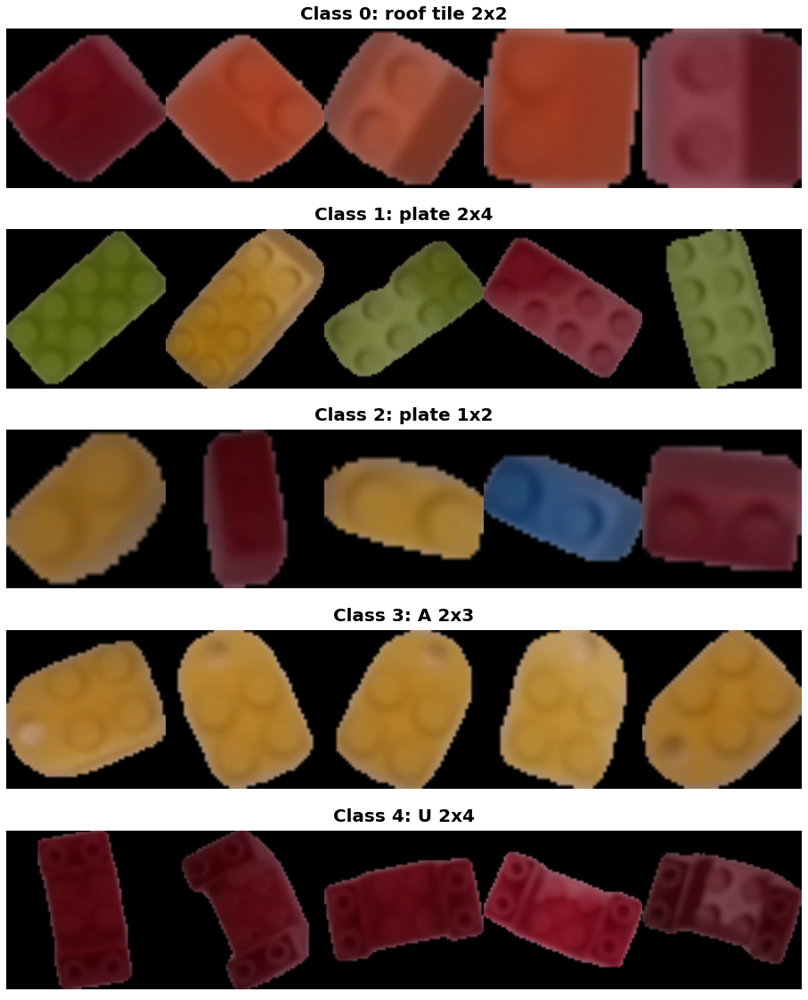
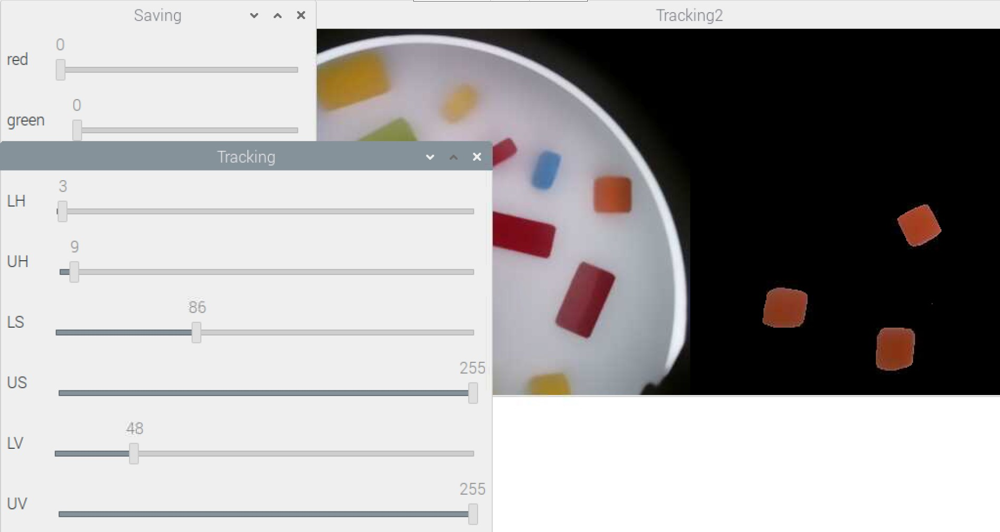
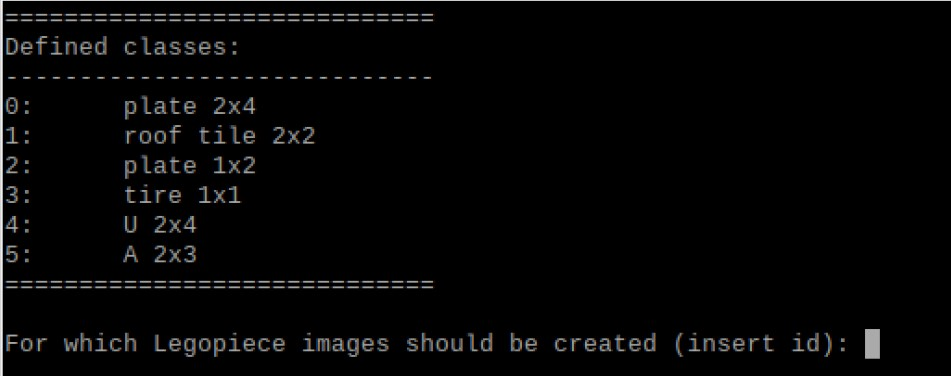
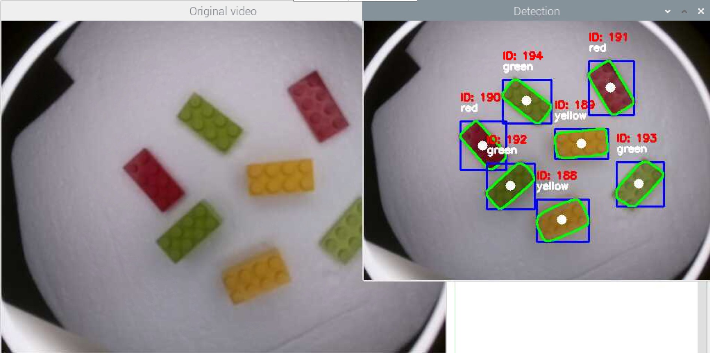
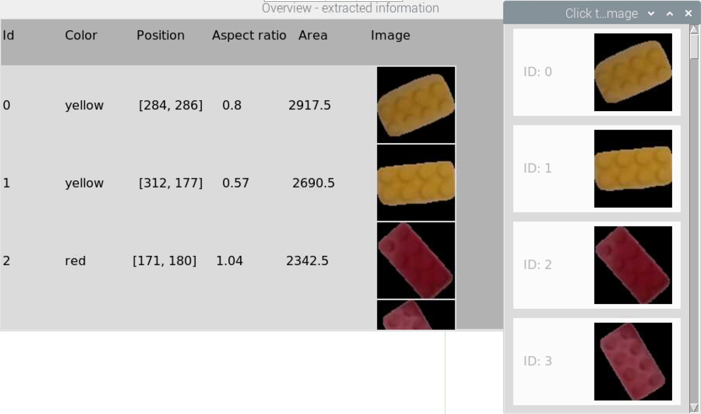
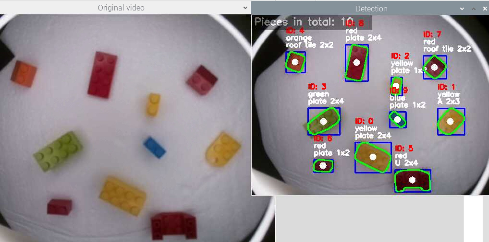
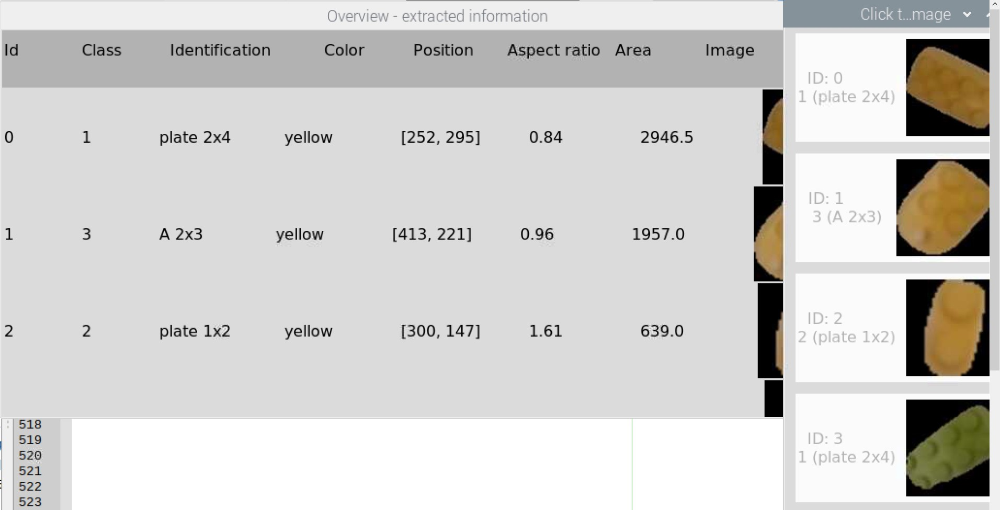

# industrial_computer_vision_21
Repo for the course "Industrial Computer Vision" at University of Aveiro, group 1

## Table of Contents  
- [ignore](#ignore)
  - [PreProcessAndSegmentation](#PreProcessAndSegmentation)
  - [OpenCV_tutorials](#OpenCV_tutorials)
- [hsv_thresholds](#hsv_thresholds)
- [models](#models)
- [own_dataset](#own_dataset)
- [python](#python)

<a name="ignore"/>
<a name="PreProcessAndSegmentation"/>
<a name="OpenCV_tutorials"/>
<a name="hsv_thresholds"/>
<a name="models"/>
<a name="own_dataset"/>
<a name="python"/>

## ignore
This folder contains outdated scripts and code snippets and can be ignored in the greater context.
Anyway, an important step in the pipeline is the preprocessing of obtained images. Codes for this process can be found in the folder

- PreProcessAndSegmentation

Scripts | Description
-------|-----------------------------------
aquireImage.py   | aquire image via 3 options: a) load image b) save frame of camera c) save frame of a video
edgeDet.py   | Script for canny-edge-detection with (pre- and postprocessing)
edgeDetectionInteractive.py   | Interactive script to find out the 2 parameters for canny-edge-detection (with preprocessing)
hsvThresholdingInteractive.py   | Interactive script to find out colorbased thresholding in HSV-Colorspace
nearest-neighbor-classify-LAB.py   | Color-based calibration and segmentation in LAB-Space (Nearest Neighbor-Method)

- OpenCV_tutorials

Useful code snippets and notes of some the opencv tutorials.

## hsv_thresholds
This folder contains .txt files which contain lower and upper boundaries of the corresponfing HSV Color and another folder, in which images are save on which the color calibration can be performed.

## models
This folder contains .tflite models which were trained on the dataset and can be used to perform predictions on the RaspberryPi.
Therefore the image data set was zipped (.zip) and uploaded to Google Drive. In the next step Google GPU Backend for Google Colab was used for training the CNN faster in the cloud.
The trained model is then saved on Google Drive, downloaded and transfered to the RaspberryPi where it can be used to perform predictions on new image data.

Notebook: https://drive.google.com/file/d/1PNyl5kIR6DC3Wm9g0pjw5vuS2nyDFgEM/view?usp=sharing 

## own_dataset
This is a self created dataset of lego bricks. 
 

Currently it consists of **5 different classes** of Lego and contains **~1100 images (".png", RGB encoded, 224x224)**.

## python
This folder contains 3 the python scipts which can be run on the RaspberryPi:

- **hsv_thresholding_interactive_v2.py**

Description | Example image
-------|-----------------------------------
This script opens 3 windows and allows to set different thresholds in the HSV colorspace. Those thresholds can than be saved to .txt files.   |  

- **image_accuisition.py**

Description | Example image
-------|-----------------------------------
This scipts asks the user for which class of lego he wants to create images.   | 
After the input of the prefered id, the program shows a video stream of the camera and in a second window the detected video. By moving the camera, new ids are given to the pieces, showing them in different lightning and angles.   |  
After hitting 'ESC', two windows are shown. One contains information about all the detected pieces, the second one only shows the Id and the extracted image of this piece. By clicking on those columns, the images are saved to the 'dataset/<id>' folder.   |  

- **lego_brick_detection.py**
  
 Description | Example image
-------|-----------------------------------
This script detects lego pieces in the video stream and uses a tflite model which was trained on Google Colab to predict the class of the lego pieces   | 
  After hitting 'ESC', two windows are shown. One contains information about all the detected pieces, the second one only shows the Id, the extracted image and the predicted class of this piece. In case this predicted id is correct, those columns can be clicked and the images are saved to the 'dataset/<id>' folder in order to increase the size of the dataset with wich the model can be trained.   |  

